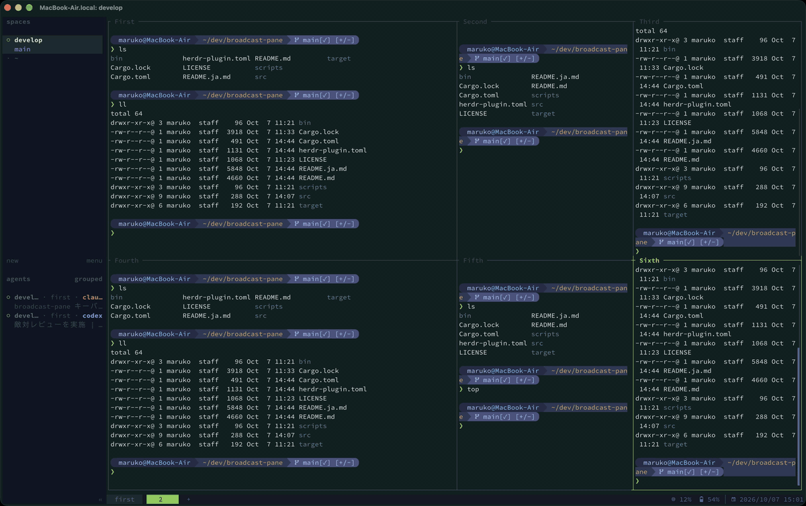

# broadcast-pane

[English](README.md)

[Herdr](https://herdr.dev) で、打ったキーをタブ内の全ペイン（または選んだペイン）へ同時に送るプラグインです。
使い勝手は tmux の `synchronize-panes` に近いものです。



キーを押すと、画面中央に小さな入力用のポップアップが開き、そこで打ったキーが各ペインに送られます。
ペインの配置はそのままなので、ポップアップの周りで各ペインの様子を見ながら操作できます。

```
┌─ pane 1 ──────────┬─ pane 2 ──────────┐
│ $ uptime          │ $ uptime          │
│  10:12 up 3d      │  10:12 up 9d      │
│ ┌─ Broadcast ───────────────────────┐ │
│ │ broadcast → 2/2 (1 web, 2 api)  … │ │
│ │   ls⏎                             │ │
│ │ › echo hi                         │ │
│ └───────────────────────────────────┘ │
└───────────────────┴───────────────────┘
```

- **送るのは入力用のキーだけ**: 文字（日本語入力で確定した文字も含む）、`Enter`、`Backspace`、`Tab`、`Ctrl+c`、
  `Alt+Enter` と、行編集のキー（`Ctrl+a`/`e`/`b`/`f`/`k`/`u`/`w`、`←` `→`、`Home`/`End`/`Del`）を送ります。
  `Esc`、`Ctrl+d`、`Ctrl+l`、`Ctrl+r`、`Ctrl+z`、`Alt`+キーなど、それ以外のショートカットは送りません。
- **送り先**: 最初は、ポップアップを開いたタブのペイン全部です（開く前にいたペインも含みます）。
  途中で閉じたペインは送り先から外れ、送り先がなくなるとポップアップも閉じます。
- **送り先を選ぶ**: `Ctrl+]` を押すと、入力用のポップアップが送り先を選ぶポップアップに切り替わります。
  タブのペインが 1 行に 1 つずつ並び、送り先は `●`、外したペインは `○` で表示されます。
  ポップアップの高さはペインの数に合わせて変わり（最大で画面の半分）、入りきらないときはスクロールします。
  - 上下キー、`Ctrl+p`/`Ctrl+n`、`j`/`k` で移動し、`Space` で送る／送らないを切り替えます。
  - 数字キー（1〜9）を押すと、その番号のペインを直接切り替えられます。
    `a` で全部選択します（全部選択されているときは全部解除）。
  - `Enter`、`Esc`、`Ctrl+]` で入力用のポップアップに戻ります。入力途中の行もそのまま残っています。
  - 番号は画面上の位置の順（上から、同じ高さなら左から）です。各行には、`prefix+P` で付けたペイン名
    （なければ端末のタイトル、agent 名、作業ディレクトリ名）と、agent 名、作業ディレクトリが表示されます。
  - 選んだ送り先はポップアップを閉じるまで有効です。次に開いたときは、また全ペインが送り先になります。
- **打ったキーを表示**: ポップアップには、入力中の行と直前の行が表示されます。
  `Ctrl+a`、`Ctrl+e`、`Ctrl+k`、`Ctrl+u`、`Ctrl+w`、`←` `→` などの行編集も表示に反映されます。
  `Alt+Enter` で改行したあとは、カーソルのある行が表示されます（`Ctrl+p`/`Ctrl+n`、上下キーで行を移動）。
  `Tab` は `‹Tab›` と表示されます。
  なお、送り先のシェルの状態（補完の結果や履歴の中身）まではわからないため、表示されるのはあくまで打ったキーの記録です。
- **履歴を呼び出さない**: 上下に移動できる行がないときは、`Ctrl+p`/`Ctrl+n` や上下キーを送りません。
- **`Ctrl+g` か `Ctrl+q` で終了**します。

## 制限

- Herdr のプラグインは、通常のペインに打ったキーを横取りできません。そのため、入力は専用のポップアップで行います。
- ポップアップは位置を指定できず、画面中央に表示されます。そのぶん、各ペインの中央付近が隠れます。
- Herdr ではポップアップを同時に 1 つしか開けず、開いたあとに大きさを変えることもできません。
  そのため、送り先を選ぶときは入力用のポップアップを閉じて、別のポップアップを開き直しています。
  切り替わる一瞬の間に打ったキーは失われます。
- ポップアップを開いている間は、Herdr の prefix キーもポップアップに入力されるため、prefix のコマンドは使えません。
- ポップアップを開いたあとに増やしたペインには送られません。`Ctrl+]` で送り先を選ぶ画面を開くと、一覧に追加されます。
- 入力用以外のキー（`Esc`、`Ctrl+d` など）は送らないので、vim や top などを操作することはできません。
- `Ctrl+g`、`Ctrl+q`、`Ctrl+]` は送れません。

## 必要なもの

- Herdr 0.9.2 以降
- macOS または Linux（macOS で動作確認済み）
- ビルド用に Rust 1.85 以降（`cargo`）

## インストール

```sh
herdr plugin install abroller666/broadcast-pane
```

インストールのときに `scripts/build.sh`（`cargo build --release`）が実行され、`bin/broadcast-pane` が作られます。

`~/.config/herdr/config.toml` で、プラグインを開くキーを割り当てます。

```toml
[[keys.command]]
key = "prefix+a"
type = "plugin_action"
command = "abroller666.broadcast-pane.open"
description = "broadcast to all panes"
```

`herdr server reload-config` を実行すると反映されます。

## 開発

clone したリポジトリを使う場合は、先にビルドしてから link します（`herdr plugin link` はビルドを行いません）。

```sh
git clone https://github.com/abroller666/broadcast-pane.git
cd broadcast-pane
sh scripts/build.sh
herdr plugin link .
```

```sh
cargo test
cargo clippy --all-targets
sh scripts/build.sh   # 変更後に再ビルドすると、次に開いたポップアップから反映される
```

## ライセンス

MIT
